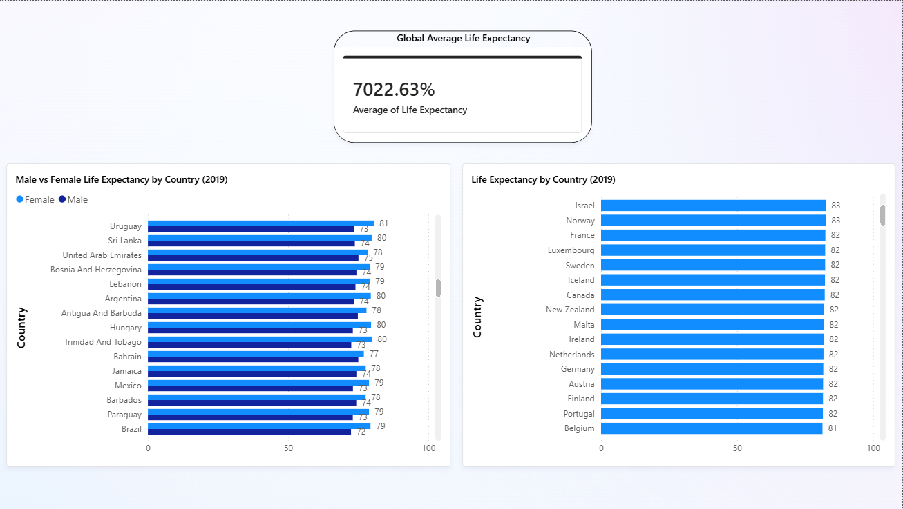

# Data Portfolio

Hi! I'm Advika, an incoming MSc Biotechnology and Business student at UCD Dublin.
I am building my data skills in Excel, SQL and Power BI.

---

## Project 1 — WHO Global Life Expectancy Analysis

**Tool:** Excel  
**Data:** WHO World Health Statistics 2020  
**Skills:** Data cleaning, Pivot Tables, Data Visualisation

### What I did
- Cleaned raw WHO dataset — fixed decimal formatting, removed redundant columns and renamed headers
- Built a pivot table to compare life expectancy across 180+ countries
- Created a bar chart of the top 10 countries by life expectancy in 2019

### Key Findings
- Japan had the highest life expectancy in 2019 at 84.26 years
- Lesotho had the lowest life expectancy in 2019
- Western European and East Asian countries dominate the top 10

## Project 2 — WHO Life Expectancy SQL Analysis

**Tool:** SQL (SQLite via DB Fiddle)  
**Data:** WHO World Health Statistics 2020  
**Skills:** SELECT, WHERE, ORDER BY, AVG, COUNT, ROUND

### Queries Written
- Ranked all countries by life expectancy
- Filtered countries with life expectancy below 60
- Calculated average life expectancy for high performing countries

### Key Findings
- Japan highest at 84.26 years
- Lesotho and Nigeria below 60 years
- 12 out of 17 countries exceed 75 years with an average of 80.48

[View SQL Fiddle here] https://www.db-fiddle.com/f/r5D2GmUBCvic9JRogpg3bU/2

## Project 3 — WHO Life Expectancy Power BI Dashboard

**Tool:** Power BI  
**Data:** WHO World Health Statistics 2020  
**Skills:** Data visualisation, Filtering, Clustered bar charts, Card visuals

### What I did
- Loaded cleaned WHO dataset into Power BI
- Built a bar chart ranking countries by life expectancy in 2019
- Built a clustered bar chart comparing Male vs Female life expectancy
- Added a card showing global average life expectancy of 70.25 years

### Key Findings
- Japan has the highest life expectancy in 2019
- Women outlive men in every single country in the dataset
- Global average life expectancy is 70.25 years

## Project 4 — COVID-19 Clinical Trials Analysis

**Tool:** Excel  
**Data:** ClinicalTrials.gov — 8,133 COVID-19 clinical trials  
**Skills:** Data cleaning, Pivot Tables, Treemap Visualisation

### What I did
- Cleaned 8,133 rows of real COVID-19 clinical trial data from ClinicalTrials.gov
- Removed irrelevant columns and fixed data entry errors across multiple columns
- Extracted primary interventions, conditions, sponsors and countries from messy multi-value cells
- Built a pivot table to identify the most trialled drugs and interventions
- Created a Treemap chart to visualise intervention frequency

### Key Findings
- Hydroxychloroquine was the most trialled drug with 75 trials
- Remdesivir, Ivermectin, Tocilizumab and Favipiravir featured heavily
- Convalescent Plasma was the most common biological intervention
- Large number of trials had unknown interventions showing the rushed nature of early COVID research

## Project 5 — COVID-19 Clinical Trials SQL Analysis

**Tool:** SQL (SQLite via SQLiteOnline)  
**Data:** ClinicalTrials.gov — 8,133 COVID-19 clinical trials  
**Skills:** SELECT, COUNT, GROUP BY, ORDER BY, AVG, CAST, WHERE

### What I did
- Imported 8,133 rows of real COVID-19 clinical trial data into SQLiteOnline
- Wrote 5 SQL queries to analyse trial patterns across countries, phases, status and funding

### Key Findings
- United States ran the most COVID trials (1,780) — more than double France (894)
- Phase 2 was the most common trial phase (907 trials)
- More trials were Completed (2,660) than still Recruiting (2,563)
- Observational studies had far larger average enrollment (68,135) than Interventional (11,522)
- Only 13% of trials were directly funded by Industry — most funded by hospitals and universities

*More projects coming soon — SQL and Power BI*
