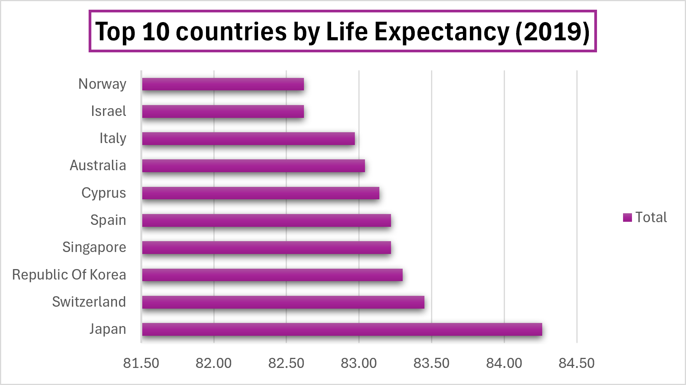

# Data Portfolio

Hi! I'm Advika, an incoming MSc Biotechnology and Business student at UCD Dublin.
I am building my data skills in Excel, SQL and Power BI.

---

## Project 1 — WHO Global Life Expectancy Analysis

**Tool:** Excel  
**Data:** WHO World Health Statistics 2020  
**Skills:** Data cleaning, Pivot Tables, Data Visualisation

### What I did
- Cleaned raw WHO dataset — fixed decimal formatting, removed redundant columns and renamed headers
- Built a pivot table to compare life expectancy across 180+ countries
- Created a bar chart of the top 10 countries by life expectancy in 2019

### Key Findings
- Japan had the highest life expectancy in 2019 at 84.26 years
- Lesotho had the lowest life expectancy in 2019
- Western European and East Asian countries dominate the top 10

## Project 2 — WHO Life Expectancy SQL Analysis

**Tool:** SQL (SQLite via DB Fiddle)  
**Data:** WHO World Health Statistics 2020  
**Skills:** SELECT, WHERE, ORDER BY, AVG, COUNT, ROUND

### Queries Written
- Ranked all countries by life expectancy
- Filtered countries with life expectancy below 60
- Calculated average life expectancy for high performing countries

### Key Findings
- Japan highest at 84.26 years
- Lesotho and Nigeria below 60 years
- 12 out of 17 countries exceed 75 years with an average of 80.48

[View SQL Fiddle here] https://www.db-fiddle.com/f/r5D2GmUBCvic9JRogpg3bU/2

## Project 3 — WHO Life Expectancy Power BI Dashboard

**Tool:** Power BI  
**Data:** WHO World Health Statistics 2020  
**Skills:** Data visualisation, Filtering, Clustered bar charts, Card visuals

### What I did
- Loaded cleaned WHO dataset into Power BI
- Built a bar chart ranking countries by life expectancy in 2019
- Built a clustered bar chart comparing Male vs Female life expectancy
- Added a card showing global average life expectancy of 70.25 years

### Key Findings
- Japan has the highest life expectancy in 2019
- Women outlive men in every single country in the dataset
- Global average life expectancy is 70.25 years

*More projects coming soon — SQL and Power BI*
